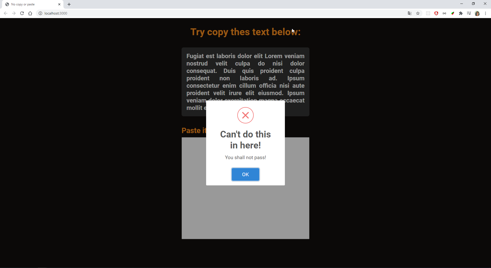

# No Copy or paste
Projeto criado just 4fun para impedir que o usuário seja capaz de copiar texto da DOM e cole na textarea. Até brinco na pagina que o usuário deve copiar o texto e copiar na textarea abaixo, porém ao gatilhar o evento de copy aparece um pop-up da lib sweetAlert que informa que não pode fazer a cópia,

## Conforme imagem abaixo:

